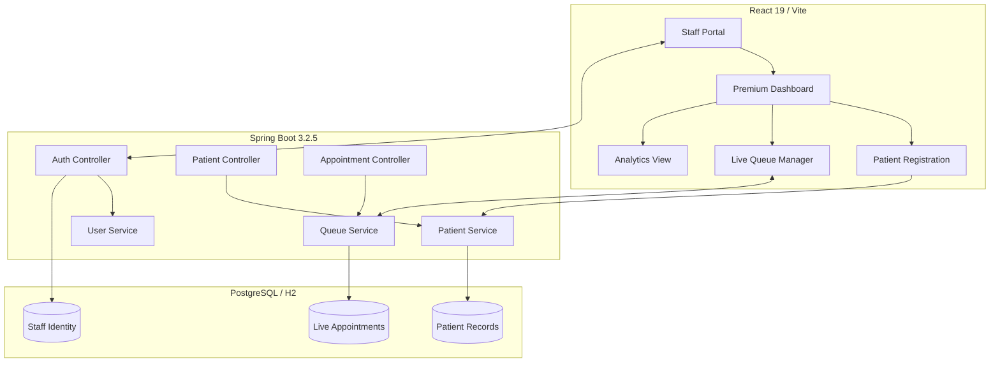
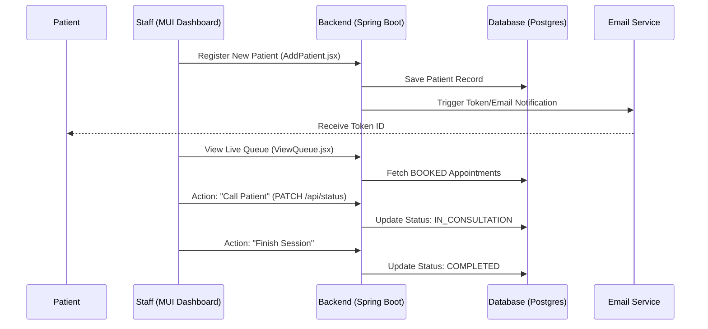

# SmartHealth: Healthcare Appointment & Queue Management System

SmartHealth is a professional-grade, full-stack healthcare platform designed to streamline patient onboarding and real-time clinic coordination. Built with a **Premium Glassmorphism UI** and a robust **Spring Boot** architecture, it provides a seamless experience for both medical staff and patients.

---

## 🎨 System Architecture (Optimized for Eraser AI)

Copy the Mermaid code below into [Eraser.io](https://www.eraser.io/) to generate a professional architectural flowchart.



---

## 🏥 Patient Journey Flow



---

## 🚀 Key Features

*   **Premium UI/UX**: State-of-the-art glassmorphism design system using HSL-tailored colors and Framer Motion micro-animations.
*   **Live Queue Manager**: Real-time coordination of patient consultations with automated status transitions.
*   **Persistent Data**: Fully integrated with PostgreSQL for production durability on Render.
*   **Analytics Overview**: Dynamic Recharts visualization of weekly patient visit trends.
*   **Automated Notifications**: Token-based system with email integration for patient arrival tracking.
*   **Staff Portals**: Secure authentication for medical administrators with auto-redirect capabilities.

---

## 🛠️ Technology Stack

| Layer | Technologies |
| :--- | :--- |
| **Frontend** | React 19, Vite, Material UI 7, Framer Motion, Recharts, Axios |
| **Backend** | Java 17, Spring Boot 3.2.5, Spring Data JPA, Hibernate, Maven |
| **Database** | PostgreSQL (Production), H2 (Local Development) |
| **Hosting** | Render (Optimized for Port 8080) |

---

## ⚙️ Setup & Installation

### 1. Backend (Spring Boot)
1. Navigate to the `Healthcarebackend` directory.
2. Ensure you have **Maven** and **Java 17** installed.
3. (Optional) Configure PostgreSQL variables in your environment for persistence.
4. Run the application:
   ```bash
   mvn spring-boot:run
   ```

### 2. Frontend (React)
1. Navigate to the `Healthcarefrontend` directory.
2. Install dependencies:
   ```bash
   npm install
   ```
3. Start the development server:
   ```bash
   npm run dev
   ```

---

## 🌍 Environment Variables (Production)

To ensure the backend operates correctly on Render with a persistent database, configure the following:

| Variable | Description |
| :--- | :--- |
| `SPRING_DATASOURCE_URL` | PostgreSQL Connection String |
| `SPRING_DATASOURCE_USERNAME` | Database User |
| `SPRING_DATASOURCE_PASSWORD` | Database Password |
| `SPRING_DATASOURCE_DRIVER` | `org.postgresql.Driver` |

---

## 📂 Project Structure

```text
Healthcareappointmentproject/
├── Healthcarebackend/         # Spring Boot API
│   ├── src/main/java/         # Core Java Logic
│   └── src/main/resources/    # Config & Properties
├── Healthcarefrontend/        # React Dashboard
│   ├── src/pages/             # Premium UI Components
│   └── src/api/               # API Integration Logic (api.jsx)
└── README.md                  # System Documentation
```

---

> [!TIP]
> Developed with a focus on modern aesthetics (HSL color mapping) and high-performance backend architecture.
